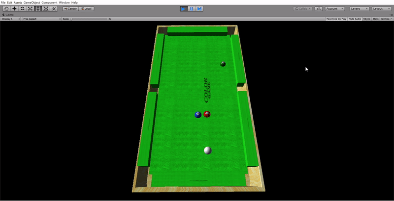
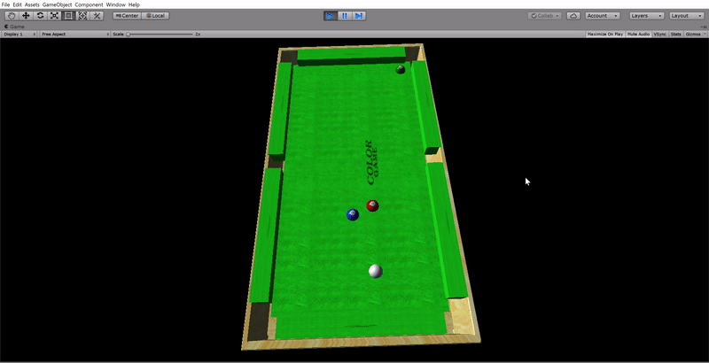
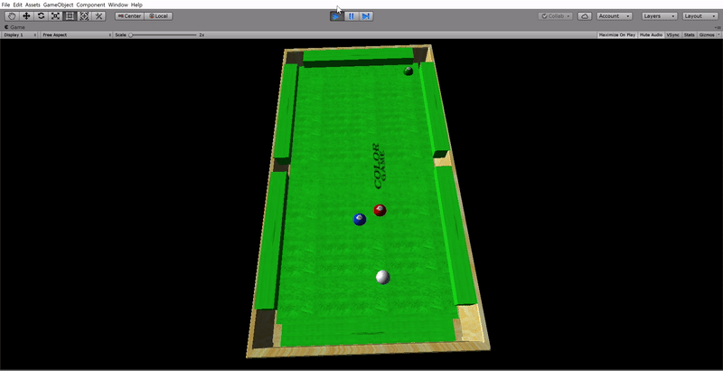
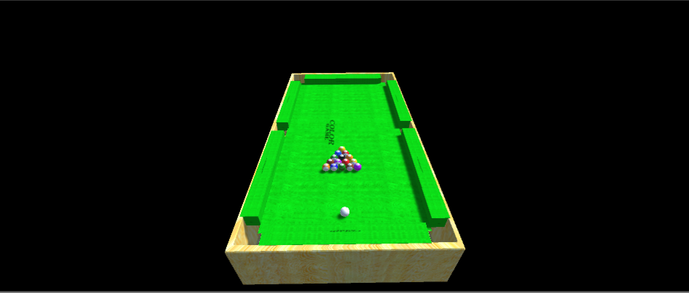
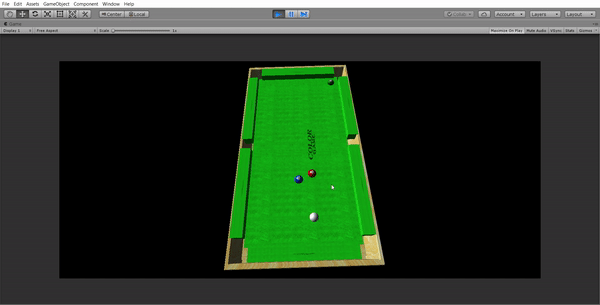

# Physics-Simulation: Billiards Shot

#### Demo Link(s)
 
 ### Basic Shot
    
 If gif not viewable, please checkout the YouTube Link: <https://youtu.be/oPvjWj2i880>  
 
 ### High Restitution
   
 If gif not viewable, please checkout the YouTube Link: <https://youtu.be/8PjP9CsUYVg>  

 ### High Friction
   
 If gif not viewable, please checkout the YouTube Link: <https://youtu.be/l28-7al9Cds>  

#### Goal 
Write a system that will simulate a single shot of a billiards game.

#### Assumptions
¤ Simplifying assumptions
¤ All balls have the same mass ¤ In reality the cue is heavier than the rest. 
¤ Balls will always remain in contact with the table 
¤ Ignore vertical motion of balls
¤ Collisions between balls will be totally elastic 
¤ All momentum is conserved

### Parameters
¤Describes position of balls and initial
forces
¤ All values will be given in common units.
¤ R G B x y z
      
      ¤ (R, G, B) is color of the ball
      ¤ (x,y,z) is position of ball
¤ 1st ball is assumed to be the cue ball (the ball to which force is to be applied)
¤ Describes position of balls and initial forces 
¤ Initial impact ¤ X Y Z x y z ¤ (X, Y, Z) = linear momentum to apply to cue 
¤ (x,y,z) = initial rotational momentum ¤ = vector gives axis of rotation ¤ = magnitude gives angle
¤ Describes position of balls and initial forces ¤ Friction coeffients 
¤ us ur e 
    
     us = friction constant (sliding)  ur = friction constant (rolling)  e = Coefficient of restitution (for cushion collisions) 
     
### Basic assignment:
¤ Only consider translational motion 
¤ Only consider translational effects of friction. 
¤ Use Euler integration

### Extras 
¤ Add pockets (5 points)
¤Consider rotational motion (15 points) 
¤ Account for rotation resultant from friction (5 points) 
¤ Rotational momentum transfer due to collisions (10 points) 
¤Implement Runge-Kutta Integration ¤ 2nd order / midpoint (5 points) 
¤ 4th order (5 points)

### Screenshot

## Extra Implemented - Pockets
 
 High Restitution shot with Pockets implemented:

 

High Restitution shot without Pockets implemented:

 
